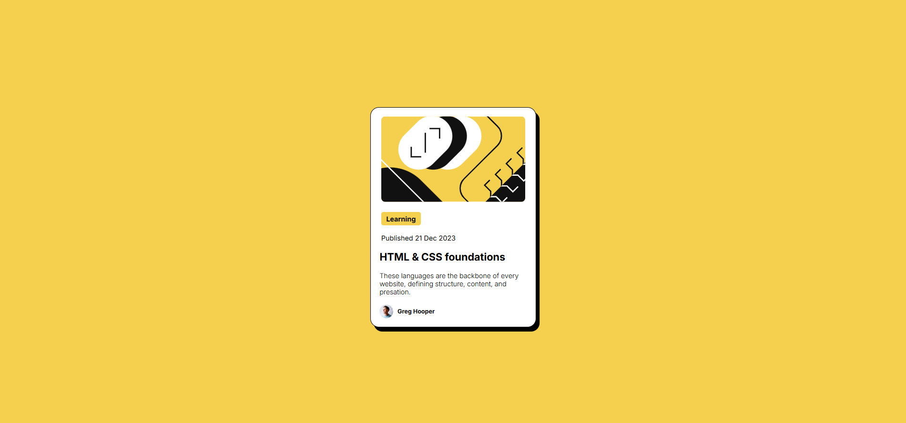

# Desafio - Getting started on Frontend Mentor

Este repositório contém os desafios que estou realizando do site [Frontend Mentor](https://www.frontendmentor.io/profile/emillymoitinho). O objetivo é praticar e aprimorar minhas habilidades em desenvolvimento frontend, resolvendo desafios práticos e aplicando as melhores práticas de HTML e CSS.

## 💭 Resultados de aprendizagem
-Aprendi a usar o Frontend Mentor para aprimorar minhas habilidades em desenvolvimento frontend.
- Configurei meu ambiente de desenvolvimento para facilitar a criação de projetos.
- Adquiri noções básicas de Git e GitHub, incluindo controle de versão e colaboração.
- Aprendi a interpretar e trabalhar com arquivos de design.
- Concluí meus primeiros projetos, aplicando esses conhecimentos na prática.

## Desafios

Cada desafio está em uma pasta separada, com o código fonte e arquivos necessários para visualizar o projeto. Eles variam em nível de dificuldade, desde projetos iniciantes até avançados.

### Desafio - QR Code
Site: [QR Code](https://emillymoitinho.github.io/introduction_FrontendMentor/qr-code-component-main/)

Repositório: [Repositório QR Code](https://github.com/emillymoitinho/introduction_FrontendMentor/tree/main/qr-code-component-main)

Link do desafio: [Frontend Mentor](https://www.frontendmentor.io/solutions/utilizei-html5-para-estruturar-a-pgina-e-css3-com-flexbox-lqAQNw9cSJ)

### Desafio - Card HTML & CSS
Site: [Card HTML & CSS](https://emillymoitinho.github.io/introduction_FrontendMentor/card_htmlcss/)

Repositório: [Repositório Card HTML & CSS](https://github.com/emillymoitinho/introduction_FrontendMentor/tree/main/card_htmlcss)

Link do desafio: [Frontend Mentor](https://www.frontendmentor.io/solutions/card-html-and-css-GkNGuYovtf)

### Desafio - Recipe Page
Site: [Recipe Page](https://emillymoitinho.github.io/introduction_FrontendMentor/pagina_receita/)

Repositório: [Recipe Page](https://github.com/emillymoitinho/introduction_FrontendMentor/tree/main/pagina_receita)

Link do desafio: [Frontend Mentor](https://www.frontendmentor.io/solutions/recipe-page-IsmfRkXhVo)

